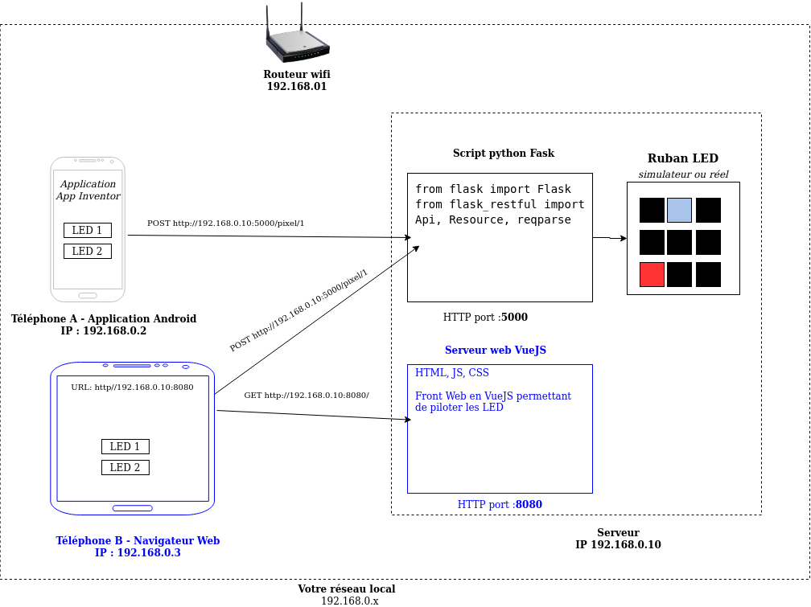

 # Client Web

Répertoire contenant le code Web pour le client du serveur de LEDs (ruban de LED).

Utilisation du framework VueJS pour la réalisation.

Au cours de cette séance nous allons détailler la mise en place d'un front web permettant de piloter chaque LED.

# 1 - Allumons une LED depuis notre navigateur Web

L'objectif de cette première partie est de mettre en place un front web simple permettant d'allumer une LED du rubant.

Le résultat ressemblera à ceci :
<!--- TODO Ajouter une image -->

L'architecture est la suivante, la partie blue est ce que nous allons faire aujourd'hui :


## VueJS comment ça marche ?

Voir vidéo ici : https://vuejs.org/

## Mise en place de l'environnement VueJS

Pour développer notre front web nous allons utiliser le framework VueJS, avec [vue-cli](https://vuejs.org/v2/guide/installation.html#CLI).

Vous devez d'abord installer NodeJS et NPM, il s'agit d'un gestionnaire de librairies javascript afin de pouvoir passer facilement d'une version de Node/NPM à une autre nous utilise [NVM (Node Version Manager)](https://github.com/nvm-sh/nvm)
```bash
# Installation de Node Version Manager, NVM nous permettant d'utiliser plusieurs versions de node en parallèle
$ curl -o- https://raw.githubusercontent.com/nvm-sh/nvm/v0.35.3/install.sh | bash
# Installation de la dernière version de node
$ nvm install node
# Vérifiez la version installée
$ node --version
v13.13.0
# Pareil pour Node Package Manager (NPM), gestionnaire de livrairie node
$ npm --version
6.14.4
```

Maitenant que vous avez le gestionnaire NPM, vous pouvez installer Vue-CLI, il s'agit d'un utilitaire permettant de lancer des pret en Vue.

```bash
# Installation de Vue-CLI
$ npm install -g @vue/cli
# Installation de Yarn (à cause de https://github.com/vuejs/vue-cli/issues/3421) Yarn est un gestionnaire de package comme NPM
$ npm install -g yarn
```

## Création d'un projet VueJS

Vue-CLI est installer nous allons maintenant créer notre projet VueJS :

```bash
$ vue create front-web-esp-led
# Sélectionner
# default (babel, eslint)
# Déplacez vous dans le dossier du projet
$ cd front-web-esp-led
# Lancez votre front Web
$ yarn serve
```

Votre serveur est lancé, rendez-vous ensuite sur ici : http://localhost:8080

Tag : **font_web-1.1**

## Mise en place de l'environnement de développement

Installation de *Visual Studio Code* (sur Ubuntu):

```bash
$ sudo snap install code
```

Démarrer *Visual Studio Code*:

```bash
$ code
```

Installer l'extension *Vetur* dans *Visual Studio Code*:

```bash
Vetur
```

## Notre premier composant

Nous allons créer notre premier composan LedControl, il affichera l'URL du serveur (Flask) et un bouton pour définir la couleur d'une LED.

### Créer un fichier LedControl.Vue

Allez dans le dossier `client_web/front-web-esp-led/src/components` puis créer le fichier `LedControl.vue` :

```html
<template>
<div>
    Serveur : <input type="text" v-model="serverUrl"><br>
    L'URL définie est : {{ serverUrl }}<br>
    Color de la led : <br>
    <ul>
        <li v-for="(colorValue, colorName) in ledColor" v-bind:key="colorName"> {{colorName}} : {{colorValue}}</li>
    </ul>

    <br><br>

</div>
</template>

<script>

export default {
  name: 'LedControl',
  data: function(){
      return {
          serverUrl: "http://localhost:5000",
          ledColor: { "red": 200, "blue": 200, "green": 200}
      }
  }
}

</script>

<style scoped>
 /** La mise en forme en CSS va ici */
</style>
```

Ce composant afficher l'URL du serveur web.

Modifiez ensuite le composant App.vue, pour qu'il affiche LedControl, voici les sources de `App.vue` :
```html
<template>
  <div id="app">
    <led-control></led-control>
  </div>
</template>

<script>
import LedControl from './components/LedControl.vue'

export default {
  name: 'App',
  components: {
    LedControl
  }
}
</script>

<style>
</style>
```

Rendez-vous ensuite sur : http://localhost:8080

Tag : **font_web-1.2**

### Envoie de la requête

TODO

# 2 - Choisir la couleur de la LED

# 3 - Choisir son ruban et piloter la couleur de chaque LED
